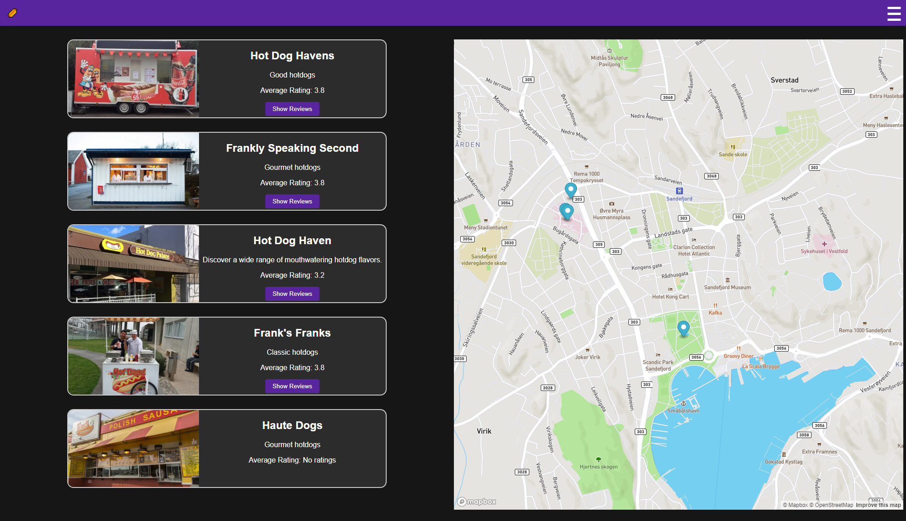

# My Next.js App: The Local Hotdog Stand Explorer



## Description

This Next.js application allows users to explore fictional hotdog stands in their local area. It features an admin panel for managing the stands, including creating, editing, and deleting stands. The app is built using Next.js, React, and Node.js.

## Live Version

The live version of this project can be found [here](https://front-end-arbeidskrav.vercel.app/). Please note, due to Vercel's limitations on backend support, the admin CRUD functionality does not work as it does in the local development environment.

## User Types and Functionalities

There are three types of users with different functionalities:

1. **Normal Users:** They can view the page, see where the stands are on the map, and view the individual hotdog stand's page.
2. **Premium Users (username: premium, password: premium123):** They have all the capabilities of normal users, plus they can submit a review for the stands. Each review must include a name, a comment, and a rating (1-5).
3. **Admin Users (username: admin, password: admin123):** They have all the capabilities of premium users, plus they can edit and delete existing stands, and create new ones. When a stand is deleted, it is not removed from the database, but replaced with empty values. This will show empty entries in the edit page that only admins can see, but not on the page where normal and premium users can see. Admins can also upload an image from their local files for the new hotdog stand.

## Session Handling

This application uses cookies to manage user sessions. When a user logs in, a session cookie is created. This cookie is essential for providing personalized experiences and for protecting certain routes based on the user's role (normal, premium, or admin).

It's important to note that these session cookies are set to expire after 10 minutes of inactivity. This means if a user does not interact with the application for 10 minutes, their session will end, and they will need to log in again. This feature is designed to improve the security of the application.

Remember, if you are testing the application and find yourself being logged out, it may be because the session cookie has expired. Simply log in again to create a new session.

## Installation and Usage

Before you start, ensure you have Node.js and npm/yarn installed on your machine.

Clone the repository:

```bash
git clone https://github.com/hernok/Front-end-arbeidskrav
```

Navigate to the project directory and install dependencies:

```bash
cd your-nextjs-app
npm install
```

To run the application in development mode, use the following command:

```bash
npm run dev
```

The application should now be running on [http://localhost:3000](http://localhost:3000).

After logging in, users can explore hotdog stands, submit reviews (if they are premium or admin users), or manage stands (if they are admin users). When a user is done, they can hit the "Log Out" button in the burger menu.

## Deployment

This project can be deployed using Vercel. For detailed instructions, refer to the [Vercel Documentation](https://vercel.com/docs). Note that due to limitations on Vercel, the admin CRUD functionality will not work as it does in the local development environment.

## Contact

If you wish to contact me, you can get hold of me here: hernok@hotmail.com.

## Credits

This project was solely developed by me.

## Dependencies

This project uses the following dependencies:

- eslint: 8.40.0
- eslint-config-next: 13.4.1
- js-cookie: 3.0.5
- multer: 1.4.5-lts.1
- next: 13.4.1
- next-auth: 4.22.1
- next-connect: 1.0.0
- react: 18.2.0
- react-burger-menu: 3.0.9
- react-dom: 18.2.0
- react-map-gl: 7.0.23
- sass: 1.62.1
- scss: 0.2.4
